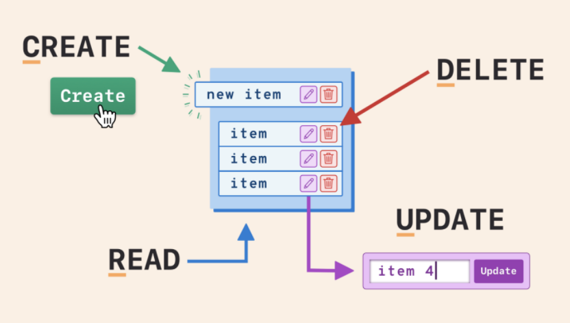
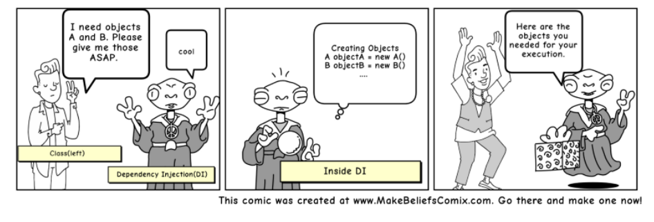
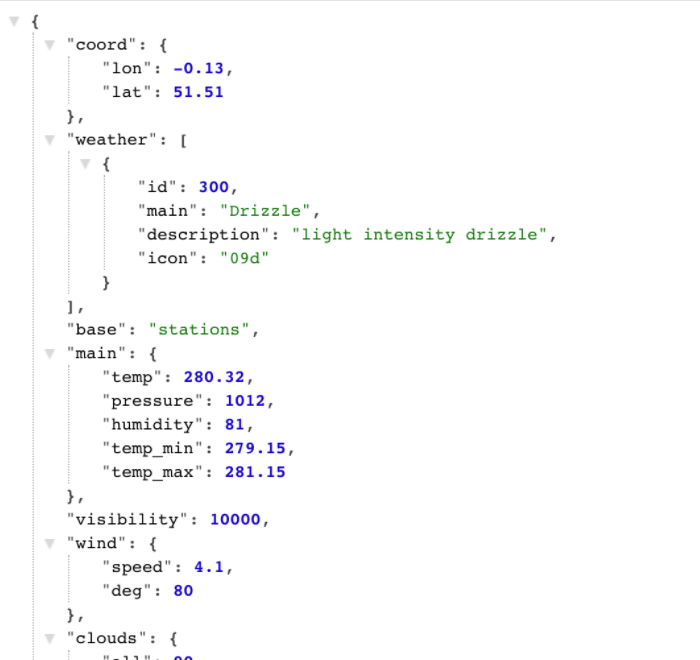
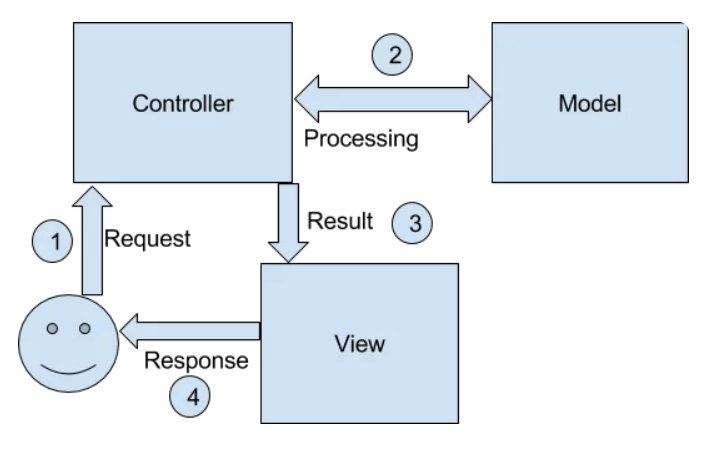
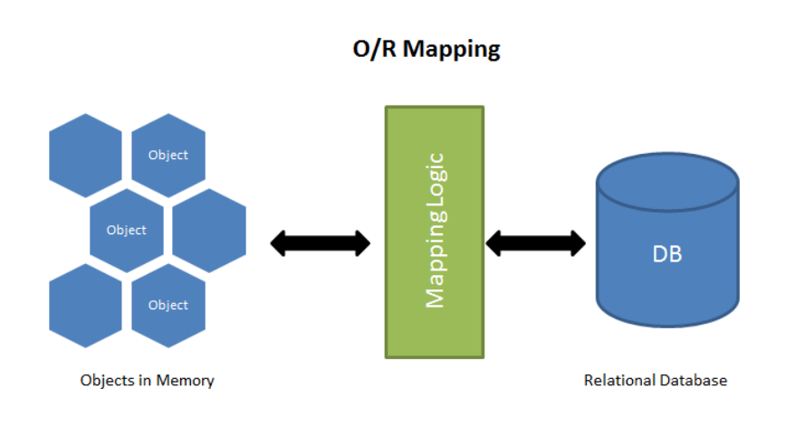
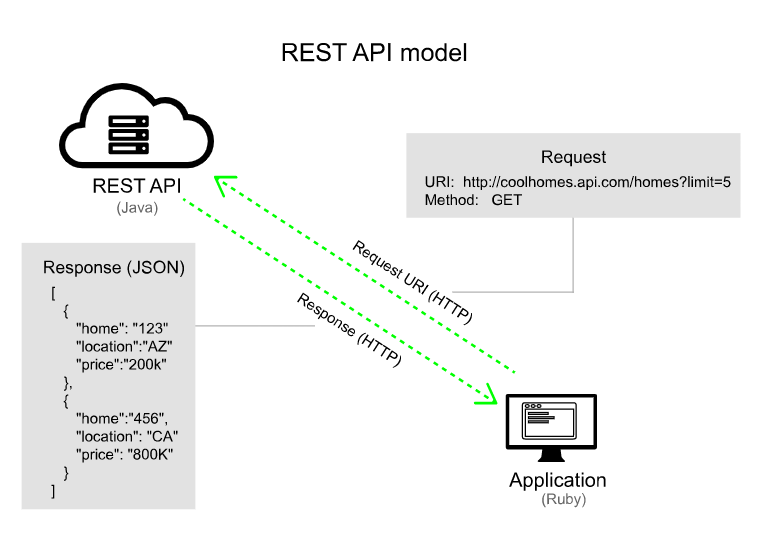
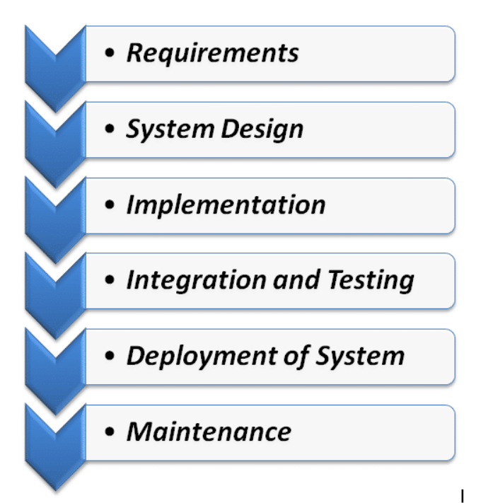
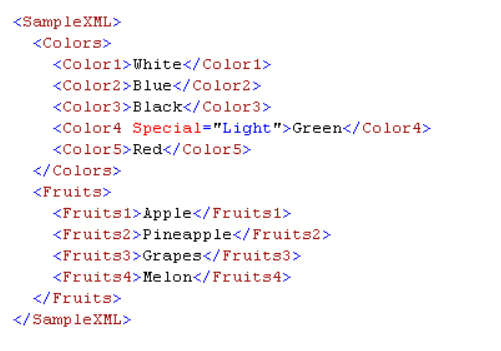

Below are few frequently used or referred terms that every Java developer comes across in Lexicographical order. This is a quick one-stop reference guide created for myself or for others who wish to brush up on these !!

## A

### Abstract Class

An abstract class can have one or multiple number of unimplemented methods. As an abstract class does not have ideally defined methods compared to a regular class, so abstract classes cannot be instantiated, that means we cannot create any direct objects of abstract classes.

### Abstract Factory Pattern

Abstract Factory pattern is similar to Factory pattern and it’s a factory of factories. If you are familiar with the factory design pattern in java, you will notice that we have a single Factory class that returns the different sub-classes based on the input provided and the factory class uses if-else or switch statements to achieve this.

In Abstract Factory pattern, we get rid of if-else block and have a factory class for each sub-class and then an Abstract Factory class that will return the sub-class based on the input factory class.

### Abstract Method

A method without body (no implementation) is known as abstract method. A method must always be declared in an abstract class, or in other words you can say that if a class has an abstract method, it should be declared abstract as well.

### Access Modifiers

Access Modifiers are keywords used to set visibility for classes, interfaces, methods, data members, and variables. In simple words, the scope of Access Modifiers in Java controls the mentioned features’ access levels. They are also referred to as Java Access Specifiers.

__The four different Access Modifiers in Java are:__

__Default__ – They are also called package-private Access Modifiers as the declarations made using Default Modifiers are visible only within the package.

__Private__ – The declarations made using Private Modifiers are visible within the class only.

__Protected__ – The declarations made using Protected Modifiers are visible within the package or all subclasses.

__Public__ – The declarations made using Public Access Modifiers are visible everywhere.

### Access Token

Access Tokens provide the authorization necessary to allow client applications to call APIs that they are subscribed to.

### Agile Development

Agile is an iterative approach to project management and software development that helps teams deliver value to their customers faster and with fewer headaches.

__Scrum__ is a framework that helps teams work together. Much like a rugby team (where it gets its name) training for the big game, scrum encourages teams to learn through experiences, self-organize while working on a problem, and reflect on their wins and losses to continuously improve.

A __sprint__ is a short, time-boxed period when a scrum team works to complete a set amount of work. Sprints are at the very heart of scrum  and agile methodologies, and getting sprints right will help your agile team ship better software with fewer headaches

Below are the __four scrum ceremonies__ that occur in each sprint. 

* Spring Planning
* Daily Scrum
* Sprint Review
* Sprint Retrospective

### API Authentication

Since API is a profound entity with an external resource that has the capability of accepting and responding to protected resource requests by users and clients, they must be equipped to ensure that applications and clients trying to access data are authentic, so that they can proceed to authorized full access when identity is confirmed. The processes of certifying the identity of users trying to access resources on the server and this is what is known as API authentication.

### API Key

An API key or application programming interface key is a code that gets passed in by computer applications. The program or application then calls the API or application programming interface to identify its user, developer or calling program to a website.

Application programming keys are normally used to assist in tracking and controlling how the interface is being utilized. Often, it does this to prevent abuse or malicious use of the API in question.

An API key can act as a secret authentication token as well as a unique identifier. Typically, the key will come with a set of access rights for the API that it is associated with.

### Application Programming Interface (API)

API is the way to expose a set of pre-defined classes and interfaces to external clients to interact with them, without sharing the implementation details.

### ApplicationContext

The ApplicationContext is the central interface within a Spring application that is used for providing configuration information to the application.
It implements the BeanFactory interface. Hence, the ApplicationContext includes all functionality of the BeanFactory and much more! Its main function is to support the creation of big business applications.

### Aspect Oriented Programming (AOP)

AOP is a way to modify existing classes in a code base to embellish them or change their behavior based on rules defined separately. This modification can be done before the classes are put into a jar/war, or can happen dynamically while the code is being loaded.

### Auto Scaling

The idea of using cloud-based technology is to provide agility and scalability to the organisations that use it. This means the server, or the computing power needs to go up significantly when required and ramp down when not needed. This in simple terms is called as Auto Scaling.
The ramping up can happen in many ways, such as increasing the size of virtual machines(Vertical scaling) or calling in more servers(Horizontal scaling) from the grid to support the requirement.

Programmers are increasingly adapting microservices or API based architecture while developing the applications. Thus making applications fragmented and modules talking to each other frequently. Consider an example of a banking application. There is significantly high traffic on the app on and around the payday of every month. During this time, the application needs extra power to respond to user requests. This is where Auto Scaling comes to the rescue.
It also means that if a programmer has set the right policies to balance the load of the application, it continues to work smoothly. As demand increases, auto-scaling automatically increases the server instances or reduces the computing power when the demand is low.

Many cloud service providers in the market provide this feature. However, the following are the big ones who offer this feature as part of this service. Amazon Web Services (AWS) call this feature as Auto Scaling Groups. Google Cloud calls this feature as Instance Groups and Microsoft Azure sells this feature under the name of Virtual Machine Scale Sets.

### Autoboxing

Autoboxing is the automatic conversion that the Java compiler makes between the primitive types and their corresponding object wrapper classes. For example, converting an int to an Integer, a double to a Double, and so on. If the conversion goes the other way, this is called unboxing.

### Autowiring

The Spring framework enables automatic dependency injection. In other words, by declaring all the bean dependencies in a Spring configuration file, Spring container can autowire relationships between collaborating beans. This is called Spring bean autowiring.

### Availability Zone

In the context of cloud computing, it is a public cloud provider’s data center that contains its own power and network connectivity. There are typically multiple Availability Zones in a region.  Each region is a separate geographic area, and each region generally has multiple, isolated locations known as Availability Zones.  A common misconception is that a single zone equals a single data center. In fact, each zone is usually backed by one or more physical data centers, with the largest backed by as many as five.  While a single availability zone can span multiple data centers, no two zones can share a data center. Abstracting things further, to distribute resources evenly across the zones in a given region, some providers independently map zones to identifiers for each account. This means an east coast availability zone for one account may not be backed by the same data centers as an east coast zone for another account.

## B

### Bean

Beans are the objects of classes that are managed by Spring. Traditionally, objects used to create their own dependencies, but Spring manages all the dependencies of an object and instantiates the object after injecting the required dependencies. The @Component annotation is the most common method of defining beans.

### BeanFactory

The BeanFactory is the actual container which instantiates, configures, and manages a number of beans. These beans typically collaborate with one another, and thus have dependencies between themselves. These dependencies are reflected in the configuration data used by the BeanFactory (although some dependencies may not be visible as configuration data, but rather be a function of programmatic interactions between beans at runtime).

### Bill Of Materials (BOM)

A bill of materials (BOM) is a comprehensive inventory of the raw materials, assemblies, subassemblies, parts and components, as well as the quantities of each, needed to manufacture a product. In a nutshell, it is the complete list of all the items that are required to build a product.

### Builder Pattern

This pattern was introduced to solve some of the problems with Factory and Abstract Factory design patterns when the Object contains a lot of attributes. Builder pattern solves the issue with a large number of optional parameters and inconsistent state by providing a way to build the object step-by-step and provide a method that will actually return the final Object.

### Bytecode

Bytecode is program code that has been compiled from source code into low-level code designed for a software interpreter. It may be executed by a virtual machine (such as a JVM) or further compiled into machine code, which is recognized by the processor.

## C

### Classpath

Classpath is a parameter in the Java Virtual Machine or the Java compiler that specifies the location of user-defined classes and packages. The parameter may be set either on the command-line, or through an environment variable.

### Cloud Native

The term cloud native refers to the concept of __building and running applications__ to take advantage of the distributed computing offered by the cloud delivery model. Cloud native apps are designed and built to exploit the scale, elasticity, resiliency, and flexibility the cloud provides.

### Cloud Provider

A cloud provider is a third-party company offering a cloud-based platform, infrastructure, application, or storage services.  Often defined by a pay-per-use model, cloud service providers also give companies a wide range of benefits. Businesses can take advantage of scalability and flexibility by not being limited to physical constraints of on-premises servers, the reliability of multiple data centers with multiple redundancies, customization by configuring servers to user preferences, and responsive load balancing that can easily respond to changing demands. The top providers are Amazon Web Services, Microsoft Azure, and Google Cloud Platform, though there are dozens more.

### Cluster

Multiple computing nodes or hosts that work together to support an application or middleware such as a database. A cluster is a group of inter-connected computers or hosts that work together to support applications and middleware (e.g. databases).  In a cluster, each computer is referred to as a “node”.

Unlike grid computers, where each node performs a different task, computer clusters assign the same task to each node. Nodes in a cluster are usually connected to each other through high-speed local area networks. Each node runs its own instance of an operating system. A computer cluster may range from a simple two-node system connecting two personal computers to a supercomputer with a cluster architecture. Computer clusters are often used for cost-effective high-performance computing (HPC) and high availability (HA). If a single component fails in a computer cluster, the other nodes continue to provide uninterrupted processing.  A computer cluster can provide faster processing speed, larger storage capacity, better data integrity, greater reliability and wider availability of resources. Computer clusters are usually dedicated to specific functions, such as load balancing, high availability, high performance or large-scale processing.

### Compiler

Java compiler refers to a program which translates Java language source code into the Java Virtual Machine (JVM) bytecodes.

### CONNECT Request Method

The CONNECT request method is used by the client to create a network connection to a web server over a particular HTTP. A good example is SSL tunneling. In a nutshell, CONNECT request establishes a tunnel to the server identified by a specific URL.

### Constructor Injection

Constructor Injection is a type of Spring Dependency Injection, where object’s constructor is used to inject dependencies. This type of injection is safer as the objects won’t get created if the dependencies aren’t available or dependencies cannot be resolved.

### Container

A container is a software package that __contains everything the software needs to run__. This includes the executable program as well as system tools, libraries, and settings

### Content Delivery Network (CDN)

A CDN is a network of data centers and proxy servers that are distributed geographically. Their main purpose is to provide clients with servers that are geographically close, in order to reduce latency and improve load balancing. This results in seamless and fast User Experience for the client's internet users.

### Continuous Delivery (CD)

A software engineering approach in which continuous integration, automated testing, and automated deployment capabilities allow software to be developed and deployed rapidly, reliably, and repeatedly with minimal human intervention.

### Continuous integration (CI)

A software engineering practice in which frequent, isolated changes are immediately tested and reported on when they are added to a larger code base.

### Cross Cloud

The use cases that traverse private and private cloud environments, a key enabler to a multi-cloud IT strategy.  A multi-cloud strategy enables companies to avoid vendor lock-in while capitalizing on the differing services that the major cloud providers offer, especially around security, application migration, and analytics and application development services. A cross-cloud capability is necessary to enable secure data sharing across cloud providers and regions.  Cross cloud architecture is a key enabler for Hybrid Cloud computing.

### Cross-Origin Resource Sharing (CORS)

Cross-Origin Resource Sharing (CORS) is an HTTP-header based mechanism that allows a server to indicate any origins (domain, scheme, or port) other than its own from which a browser should permit loading resources.

### CRUD

CRUD is an acronym that stands for Create, Read, Update and Delete.Think of CRUD as a simple concept that represents the four basic functions that models should be able to do and are considered necessary to implement a persistent storage application. In simpler terms, it represents the four basic operations you can do on any data.

## D

### Data Access Object (DAO)

DAO is a pattern that provides an abstract interface to some type of database or other persistence mechanism. By mapping application calls to the persistence layer, the DAO provides some specific data operations without exposing details of the database.

### DELETE Request Method

Just as it sounds, the DELETE request method is used to delete resources indicated by a specific URL. Making a DELETE request will remove the targeted resource.

### Dependency Injection

Dependency injection is a fundamental aspect of the Spring framework, through which the Spring container “injects” objects into other objects or “dependencies”.
Simply put, this allows for loose coupling of components and moves the responsibility of managing components onto the container.

__For example__: Suppose we have an object __Employee__ and it has a dependency on object __Address__. We would define a bean corresponding to __Employee__ that will define its dependency on __object__ Address.
When Spring tries to create an __Employee__ object, it will see that __Employee__ has a dependency on __Address__, so it will first create the __Address__ object (dependent object) and then inject it into the __Employee__ object.

### Design pattern

Design patterns are typical solutions to common problems in software design. Each pattern is like a blueprint that you can customize to solve a particular design problem in your code.
They are already defined and provides industry standard approach to solve a recurring problem, so it saves time if we sensibly use the design pattern. There are many java design patterns that we can use in our java based projects.
Using design patterns promotes re-usability that leads to more robust and highly maintainable code. It helps in reducing total cost of ownership (TCO) of the software product.
Since design patterns are already defined, it makes our code easy to understand and debug. It leads to faster development and new members of team understand it easily.

### DevOps

DevOps is about removing the barriers between traditionally siloed teams, development and operations. Under a DevOps model, development and operations teams work together across the entire software application life cycle, from development and test through deployment to operations

### Distributed System

A distributed system is a computing environment in which various components are spread across multiple computers (or other computing devices) on a network. These devices split up the work, coordinating their efforts to complete the job more efficiently than if a single device had been responsible for the task.

### Distributed Tracing

Distributed tracing, also called distributed request tracing, is a method for IT and DevOps teams to monitor applications, especially those composed of microservices. Distributed tracing helps pinpoint where failures occur and what causes suboptimal performance.

Distributed tracing requires the software developers to add instrumentation to the code of an application. That instrumentation provides information so that the administrator can analyze performance and the developer can debug the operations of complex software.

### Docker Base Image

A base image is the image that is used to create all of your container images. Your base image can be an official Docker image, such as Centos, or you can modify an official Docker image to suit your needs, or you can create your own base image from scratch.

### Docker Container

Docker is a tool designed to make it easier to create, deploy, and run applications by using containers. Containers allow a developer to package up an application with all of the parts it needs, such as libraries and other dependencies, and ship it all out as one package.

### Docker File

A Dockerfile is a text document that contains all the commands a user could call on the command line to assemble an image. Using docker build users can create an automated build that executes several command-line instructions in succession.

### Docker Registry

A registry is a storage and content delivery system, holding named Docker images, available in different tagged versions. Example: the image distribution/registry , with tags 2.0 and 2.1 . Users interact with a registry by using docker push and pull commands.

### Domain Name System (DNS)

The Domain Name System (or DNS) converts human readable domain names (like: www.google.com) into Internet Protocol (IP) addresses (like: 173.194.39.78).
Computers can only communicate using series of numbers, so DNS was developed as a sort of “phone book” that translates the domain you enter in your browser into a computer readable IP.

### Domain-Driven Design

A philosophy for developing software in which development is focused primarily on the business logic, the activities and issues that an application is supposed to perform or solve.

## E

### Endpoint

You use endpoints to actually call an API. As the word implies, an endpoint is the location that receives web requests. An API is a collection of endpoints. Each endpoint has its own rules on CRUD operations.

### Exception

An event during program execution that prevents the program from continuing normally; generally, an error. The Java programming language supports exceptions with the try, catch, and throw keywords.

## F

### Factory Pattern

Factory Pattern is one of the Creational Design pattern and it’s widely used in JDK as well as frameworks like Spring and Struts.

The factory design pattern is used when we have a superclass with multiple sub-classes and based on input, we need to return one of the sub-class. This pattern takes out the responsibility of the instantiation of a class from the client program to the factory class. We can apply a Singleton pattern on the Factory class or make the factory method static.

### Fault isolation

Enables a microservice to crash and restart without causing a service outage.

### Fault Tolerant

Fault tolerance is the property that enables a system to continue operating properly in the event of the failure of some of its components.

### Final

In Java, the final keyword can be used while declaring an entity. Using the final keyword means that the value can't be modified in the future. This entity can be - but is not limited to - a variable, a class or a method.

## G

### Garbage Collection

Java Garbage Collection deals with finding and deleting the garbage from memory. However, in reality, Garbage Collection tracks each and every object available in the JVM heap space and removes unused ones.

In simple words, GC works in two simple steps known as Mark and Sweep:

__Mark__ – it is where the garbage collector identifies which pieces of memory are in use and which are not.

__Sweep__ – this step removes objects identified during the “mark” phase.

__Advantages__:

No manual memory allocation/de-allocation handling because unused memory space is automatically handled by GC.

No overhead of handling Dangling Pointer.

Automatic Memory Leak management (GC on its own can't guarantee the full proof solution to memory leaking, however, it takes care of a good portion of it).

### GET Request Method

GET is used to retrieve and request data from a specified resource in a server. GET is one of the most popular HTTP request techniques. In simple words, the GET method is used to retrieve whatever information is identified by the Request-URL.

### Git

Distributed version control system commonly used when interacting with code. GitHub uses Git, as does BitBucket and other version control platforms. Learning Git is essential for working with developer documentation, since this is the most common way developers share, review, collaborate, and distribute code.

## H

### HEAD Request Method

The HEAD technique requests a reaction that is similar to that of GET request, but doesn’t have a message-body in the response. The HEAD request method is useful in recovering meta-data that is written according to the headers, without transferring the entire content. The technique is commonly used when testing hypertext links for accessibility, validity, and recent modification.

### Hibernate Framework

Hibernate is a framework which comes with an abstraction layer and handles the implementations internally. The implementations include tasks like writing a query for CRUD operations or establishing a connection with the databases, etc.

A framework is basically a software that provides abstraction on multiple technologies like JDBC, servlet, etc.

Hibernate develops persistence logic, which stores and processes the data for longer use. It is lightweight and an ORM tool, and most importantly open-source which gives it an edge over other frameworks.

### HTTP Basic Authentication

HTTP Basic Authentication is the simplest form of identification. This technique combines username and password to form a single value and passes it through a special HTTP header known as authorization where they are encoded with Base64. Therefore, when a client makes a request, the server checks the Authorization header and compares it to the credentials (username and password) it has stored. If they match, the server fulfills the client request, and if not, a special status code is sent back to inform clients that authentication has failed and their request denied.

### HTTP Request Methods

The internet boasts a vast array of resources hosted on different servers. For you to access these resources, your browser needs to be able to send a request to the servers and display the resources for you. HTTP (Hypertext Transfer Protocol), is the underlying format that is used to structure request and responses for effective communication between a client and a server. The message that is sent by a client to a server is what is known as an HTTP request. When these requests are being sent, clients can use various methods.

Therefore, HTTP request methods are the assets that indicate the specific desired action to be performed on a given resource. Each method implements a distinct semantic, but there are some standard features shared by the various HTTP request methods.

### HTTP Response Status Codes

When you make a request to an endpoint, the server:

Looks at the information sent.
Looks for the resource referenced in the request.
Checks if you have permission to access it.
Returns a response with a status code.

Each status code has a specific meaning. They are grouped together conveniently into the following five groups:

(100-199) Informational responses

(200-299) Successful responses

(300-399) Redirect messages

(400-499) Client errors (you messed up)

(500-599) Server errors (the server messed up)

## I

### Infrastructure as Code (IaC)

Infrastructure as code is the process of managing and provisioning computer data centers through machine-readable definition files, rather than physical hardware configuration or interactive configuration tools.

### Interpreter

The term Java interpreter refers to a program which implements the JVM specification and actually executes the bytecodes (and thereby running your program).

### Inversion of Control (IOC)

Inversion of Control is a principle in software engineering which transfers the control of objects or portions of a program to a container or framework. We most often use it in the context of object-oriented programming.
In contrast with traditional programming, in which our custom code makes calls to a library, IoC enables a framework to take control of the flow of a program and make calls to our custom code.

__The advantages of this architecture are:__
1.Decoupling the execution of a task from its implementation
2.Making it easier to switch between different implementations
3.Greater modularity of a program
4.Greater ease in testing a program by isolating a component or mocking its dependencies, and allowing components to communicate through contracts

## J

### Java Archive (JAR)

A JAR (Java ARchive) is a package file format typically used to aggregate many Java class files and associated metadata and resources (text, images, etc.) into one file for distribution.

JAR files are archive files that include a Java-specific manifest file. They are built on the ZIP format and typically have a .jar file extension.

### Java Development Kit (JDK)

JDK consists of development tools and run time environment (JRE). If you want to develop and run a java program, you need a JDK. It is a kit or complete package to develop, compile and execute a Java program. It means that it contains JRE and JRE contains JVM.

### Java Naming and Directory Interface (JNDI)

JNDI is an API specified in Java technology that provides naming and directory functionality to applications written in the Java programming language. It is designed especially for the Java platform using Java's object model. Using JNDI, applications based on Java technology can store and retrieve named Java objects of any type. In addition, JNDI provides methods for performing standard directory operations, such as associating attributes with objects and searching for objects using their attributes.

JNDI is also defined independent of any specific naming or directory service implementation. It enables applications to access different, possibly multiple, naming and directory services using a common API. Different naming and directory service providers can be plugged in seamlessly behind this common API. This enables Java technology-based applications to take advantage of information in a variety of existing naming and directory services, such as LDAP, NDS, DNS, and NIS(YP), as well as enabling the applications to coexist with legacy software and systems.

Using JNDI as a tool, you can build new powerful and portable applications that not only take advantage of Java's object model but are also well-integrated with the environment in which they are deployed.

### Java Runtime Environment (JRE)

JRE is responsible for providing a runtime environment only. This is the reason it does not contain any development tools like compiler and debugger.
JRE is platform dependent which makes Java a platform independent language.
It consists of JVM and many software packages (Supported classes to run Java programs, Property files etc.) which help JVM to perform its tasks.

### Java Virtual Machine (JVM)

A JVM is a set of computer software programs and data structures which use a virtual machine model for the execution of other computer programs and scripts. The model used by a JVM accepts a form of computer intermediate language commonly referred to as Java bytecode.

### JavaScript Object Notation (JSON)

JavaScript Object Notation is a lightweight syntax containing objects and arrays, usually used (instead of XML) to return information from a REST API.
It's an open standard format that allows data to be transferred across the web by using attribute-value pairs

## K

## L

### Load Balancing 

Load balancing keeps your website up even when the traffic spikes, by distributing all the incoming traffic across the server pool. It helps high-traffic websites serve thousands of requests from clients in a fast and reliable manner while returning the right text and images even with a high volume.

A load balancing software sits right in front of your server pool keeping a continuous check on client requests to maximize capacity utilization and delivery speed. When one server goes down, it automatically redirects the traffic to the remaining servers.

## M

### Message Queue

In simple terms, a message queue is a software component that sits between two or more nodes to collect and exchange messages. Software Systems can use message queues in any interprocess communication (IPC) or for inter-thread communication within the same process.

### Microservices

Microservices are a method of developing software applications which are made up of independently deployable, modular services. Each microservice runs a unique process and communicates through a well-defined, lightweight mechanism, such as a container, to serve a business goal

### Monolithic

Monolithic is a single-tiered software application in which the user interface and data access code are combined into a single program on a single platform. It's also an application that runs multiple components in the same process, on the same system.

### MVC Design Pattern

MVC Design Pattern is one of the oldest architectural pattern for web applications. MVC stands for Model View Controller. MVC Design Pattern is used to separate the logic of different layers in a program in independent units. This is known as the principle of Separation of Concern.

The model which is transferred from one layer to the other.
The View which is responsible to show the data present in the application.
The controller is responsible to accept a request from a user, modify a model and send it to the view which is shown to the user.

The idea behind MVC pattern is a very clear separation between domain objects which represents real-world entities and the presentation layer we see on the screen. Domain objects should be completely independent and should work without a View layer as well.

__MVC Application Architecture :__

Before we start building our application, it is always a good idea to structure it. Based on the MVC pattern, we will have following layers in our application.

## N

### Network Address Translation (NAT)

NAT is a way to map multiple local private addresses to a public one before transferring the information. Organizations that want multiple devices to employ a single IP address use NAT, as do most home routers.

### New Keyword

The Java new keyword is used to create an instance of the class. In other words, it instantiates a class by allocating memory for a new object and returning a reference to that memory. We can also use the new keyword to create the array object.

### Null

In Java, "null" is not a keyword, but a special literal of the null type. It can be cast to any reference type, but not to any primitive type such as int or boolean. The null literal doesn't necessarily have value zero. And it is impossible to cast to the null type or declare a variable of this type.

## O

### OAuth Authentication

Oauth is a technique that does both authentication and authorization. It is a form of API authentication that gives applications with the ability to communicate with API server to provide access. When a user logs into the system, it requests authentication in the form of a token. The client is required to forward the request to an authentication server, which either allows or rejects this it. OAuth authentication is fundamentally a more secure and powerful system than the rests, and it’s quickly becoming the number one choice for many clients and applications.

### Obfuscation

Obfuscation means to make something difficult to understand. Programming code is often obfuscated to protect intellectual property or trade secrets, and to prevent an attacker from reverse engineering a proprietary software program. Encrypting some or all of a program's code is one obfuscation method.

### Object

An entity that has state and behavior is known as an object e.g., chair, bike, marker, table, etc. It can be physical or logical (tangible and intangible). The example of an intangible object is the banking system.
An object is an instance of a class. A class is a template or blueprint from which objects are created. So, an object is the instance(result) of a class.

### Object Oriented Programming

Object Oriented Programming (OOP) is a programming paradigm that relies on the concept of classes and objects. It is used to structure a software program into simple, reusable pieces of code blueprints (usually called classes), which are used to create individual instances of objects.

### Object Relational Mapping (ORM)

ORM is a programming technique for converting data between incompatible type systems using object-oriented programming languages.
It means you can write database queries using the object oriented paradigm of your preferred language and there are many free and commercial packages available that perform object relational mapping.

ORM sets the mapping between the set of objects which are written in the preferred programming language like JavaScript and relational database like SQL. It hides and encapsulates the SQL queries into objects and instead of SQL queries we can use directly the objects to implement the SQL query.

### Orchestration

Orchestration is the automated configuration, management, and coordination of computer systems, applications, and services. Orchestration helps IT manage complex tasks and workflows more easily.
IT teams must manage many servers and applications, but doing it manually is not a scalable strategy. The more complex a computer system is, the more complex the management of all moving parts can become. The need to combine multiple automated tasks and their configurations into groups of systems or machines is increasing. This is where orchestration can help.

Orchestration is often discussed in the context of service-oriented architecture, virtualization, provisioning, converged infrastructure, and dynamic data center topics. Orchestrating in this direction is aligning business demand with applications, data and infrastructure.
Orchestration has seen a resurgence in interest and usage in recent years, as emerging IT trends, such as cloud provisioning and container application deployment, have gained wide acceptance among businesses.

## P

### Pagination

Pagination in web applications is a mechanism to separate a big result set into smaller chunks. Providing a fluent pagination navigator could increase both the value of your website for search engines and enhance user experience through minimizing the response time. The famous example of pagination is Google's search result page. Normally, the result page is separated into several pages. To avoid the bad user experience mentioned before, a lot of sites show only the current, the first, the last, and some adjacent pages.

### PATCH Request Method

A PATCH request is similar to POST and PUT. However, its primary purpose is to apply partial modifications to the resource. And just like a POST request, the PATCH request is also non-idempotent. Additionally, unlike POST and PUT which require a full user entity, with PATCH requests, you may only send the updated username.

### Payload

As a ship carries a payload to a port, some HTTP requests carry a payload to an API. HTTP requests that create records or update existing records also need to carry the data to the API. For example, when creating a user in an application with the API, you need to send the user information to the API. The payload contains the new user information (in JSON format) that the API will use to create the user.

### POJO

POJO stands for Plain Old Java Object. It is an ordinary Java object, not bound by any special restriction other than those forced by the Java Language Specification and not requiring any classpath. POJOs are used for increasing the readability and re-usability of a program.

### POST Request Method

POST is a popular HTTP request method. In web communication, POST requests are utilized to send data to a server to create or update a resource.  The information submitted to the server with POST request method is archived in the request body of the HTTP request. The HTTP POST method is often used to send user-generated data to a server.

### Private Cloud

Private cloud is a computing model that offers a proprietary environment dedicated to a single business entity. As with other types of cloud computing environments, private cloud provides extended, virtualized computing resources via physical components stored on-premises or at a vendor's datacenter.

### Private IP

A private IP address is the address your network router assigns to your device. Each device within the same network is assigned a unique private IP address (sometimes called a private network address) — using this address, devices in the same internal network talk to each other.

### Prototype Pattern

The prototype pattern is used when the Object creation is a costly affair and requires a lot of time and resources and you have a similar object already existing. So this pattern provides a mechanism to copy the original object to a new object and then modify it according to our needs. This pattern uses java cloning to copy the object.

Prototype design pattern mandates that the Object which you are copying should provide the copying feature. It should not be done by any other class. However whether to use the shallow or deep copy of the Object properties depends on the requirements and it’s a design decision.

### Public Cloud

Public cloud is an IT model where on-demand computing services and infrastructure are managed by a third-party provider and shared with multiple organizations using the public Internet. Public cloud service providers may offer cloud-based services such as infrastructure as a service (IaaS), platform as a service (PaaS), or software as a service (Saas) to users for either a monthly or pay-per-use fee, eliminating the need for users to host these services on site in their own data center.

### Public IP

A public IP address is an IP address that can be accessed directly over the internet and is assigned to your network router by your internet service provider (ISP). Your personal device also has a private IP that remains hidden when you connect to the internet through your router's public IP.

### PUT Request Method

PUT is similar to POST as it is used to send data to the server to create or update a resource. The difference between the two is that PUT requests are idempotent. This means that if you call the same PUT requests multiple times, the results will always be the same.

## Q

## R

### Representational State Transfer (REST)

REST uses HTTP as the transport protocol for the message requests and responses.
However, unlike SOAP, REST is an architectural style, not a standard protocol. As an architectural style, you aren’t limited to XML as the message format. REST APIs can use any message format the API developers want to use, including XML, JSON, Atom, RSS, CSV, HTML, and more.

Despite the variety of message format options, most REST APIs use JSON (JavaScript Object Notation) as the default message format.
They use JSON because it provides a lightweight, simple, and more flexible message format that increases the speed of communication.
The lightweight nature of JSON also allows for mobile processing scenarios and is easy to parse on the web using JavaScript.

### Request Header

A request header is an HTTP header that can be used in an HTTP request to provide information about the request context, so that the server can tailor the response. For example, the Accept-* headers indicate the allowed and preferred formats of the response. Other headers can be used to supply authentication credentials (e.g.  Authorization), to control caching, or to get information about the user agent or referrer, etc.

## S

### Security Assertion Markup Language (SAML)

### Serverless

Serverless is a cloud-native development model that allows developers to build and run applications without having to manage servers. There are still servers in serverless, but they are abstracted away from app development.

### Setter Injection

Spring Setter Injection is nothing but injecting the Bean Dependencies using the Setter methods on an Object. Unlike Spring Constructor Injection, in Setter Injection, the object is created first and then the dependency is injected.

### Singleton Pattern

Java Singleton Pattern is one of the Gangs of Four Design patterns and comes in the Creational Design Pattern category. Singleton pattern restricts the instantiation of a class and ensures that only one instance of the class exists in the Java virtual machine. It seems to be a very simple design pattern but when it comes to implementation, it comes with a lot of implementation concerns.

Singleton pattern restricts the instantiation of a class and ensures that only one instance of the class exists in the java virtual machine.
The singleton class must provide a global access point to get the instance of the class.
Singleton pattern is used for logging, drivers objects, caching and thread pool.
Singleton design pattern is also used in other design patterns like Abstract Factory, Builder, Prototype, Facade etc.
Singleton design pattern is used in core java classes also, for example java.lang.Runtime, java.awt.Desktop.

### Site Reliability Engineering (SRE)

Site reliability engineering (SRE) is a set of principles and practices that incorporates aspects of software engineering and applies them to infrastructure and operations problems.
The main goals are to create scalable and highly reliable software systems. Site reliability engineering is closely related to DevOps, a set of practices that combine software development and IT operations, and SRE has also been described as a specific implementation of DevOps.

### SOAP

SOAP stands for Simple Object Access Protocol. This method of web services transmits messages via XML, usually as an HTTP POST. SOAP services contain service operations that are requested by the calling application. These service operations usually contain verb/noun combinations (i.e. getAccountByID, getAccountByName, UpdateAccount…). One advantage to SOAP is that it provides WSDL (Web Service Definition Language) that describes the service operations. Most large enterprise applications support SOAP.

### Spring Framework

Spring was built on top of the idea of dependency injection and inversion of control. In normal words - instead of having a bunch of classes creating each other and passing each other from one place to another. You have a bag of beans, each bean declares its dependencies (what services do I need to work?) and Spring container resolves this requirements by automatically wiring everything together.

You have a Service that says (through XML, annotations, constructor signature...) I need DAO interface to work and Spring is kind enough to find some bean that implements that interface, create it first and pass where it is required.

On that foundation multiple other services were provided (mostly in terms of data access and AOP), but the injection is the core concept.

### Static

Static means that the variable or method marked as such is available at the class level. In other words, you don't need to create an instance of the class to access it.

### Synchronized

Synchronized methods enable a simple strategy for preventing thread interference and memory consistency errors: if an object is visible to more than one thread, all reads or writes to that object's variables are done through synchronized methods.

The synchronized keyword prevents concurrent access to a block of code or object by multiple threads. All the methods of Hashtable are synchronized, so only one thread can execute any of them at a time.
When using non-synchronized constructs like HashMap, you must build thread-safety features in your code to prevent consistency errors.

## T

### Thread

A thread, in the context of Java, is the path followed when executing a program. It is a sequence of nested executed statements or method calls that allow multiple activities within a single process. All Java programs have at least one thread, known as the main thread, which is created by the Java Virtual Machine (JVM) at the program’s start, when the main method is invoked with the main thread.

Each thread comes with its own local variables, program counter, and stack, and is used to perform background processing that makes graphical user interface (GUI) application smoother. It does this by simplifying program logic, especially when multiple independent entities must run asynchronously.

### Thread Safety

Java supports multithreading out of the box. This means that by running bytecode concurrently in separate worker threads, the JVM is capable of improving application performance.

Although multithreading is a powerful feature, it comes at a price. In multithreaded environments, we need to write implementations in a thread-safe way. This means that different threads can access the same resources without exposing erroneous behavior or producing unpredictable results. This programming methodology is known as “thread-safety”.

### TRACE Request Method

TRACE requests are used to invoke a remote, application loop-back test along the path to the target resource. The TRACE method allows clients to view whatever message is being received at the other end of the request chain so that they can use the information for testing or diagnostic functions.

### Transient

Transient is a Java keyword which marks a member variable not to be serialized when it is persisted to streams of bytes. When an object is transferred through the network, the object needs to be 'serialized'. Serialization converts the object state to serial bytes.

## U

## V

### Variable

A variable is a container that holds values that are used in a Java program. Every variable must be declared to use a data type. For example, a variable could be declared to use one of these primitive data types: byte, short, int, long, float, double, char and Boolean.

### Void

The void is a java return type which indicates that a particular method does not return any value but returns the control to the line of code following the last line of the method. All methods in java must have a specific return type except the constructor method and therefore when a method is not designed to return a value, the void datatype is specified to the method prototype.

## W

### Waterfall

The Waterfall Model was the first Process Model to be introduced. It is very simple to understand and use. In a Waterfall model, each phase must be completed before the next phase can begin and there is no overlapping in the phases. The waterfall model is the earliest SDLC approach that was used for software development.

In "The Waterfall" approach, the whole process of software development is divided into separate phases. The outcome of one phase acts as the input for the next phase sequentially. This means that any phase in the development process begins only if the previous phase is complete. The waterfall model is a sequential design process in which progress is seen as flowing steadily downwards (like a waterfall) through the phases of Conception, Initiation, Analysis, Design, Construction, Testing, Production/Implementation, and Maintenance.

### Web service

A web service is a web-based application that provides resources in a format consumable by other computers. Web services include various types of APIs, including both __REST__ and __SOAP__ APIs. Web services are basically request-and-response interactions between clients and servers (a computer requests a resource, and the web service responds to the request).

All APIs that use HTTP protocol as the transport format for requests and responses are considered "web services.” With web services, the client making the request for the resource and the API server providing the response can use any programming language or platform — it doesn’t matter because the message request and response are made through a common HTTP web protocol.

### Wrapper Class

The term "wrapper class" in Java refers to the classes that represent the primitive types in Object form. For example, the class java.lang.Integer wraps the primitive type int and java.lang.Double wraps double. These classes allow primitives to be used in places where an Object is required, for instance as a key to a Map or an element of a Collection.

Before the release of JDK 1.5 you were required to convert primitive values to their equivalent wrapper class explicitly. JDK 1.5 introduced the feature of autoboxing, where primitives can be implicitly converted to their wrapper type and vice versa.

## X

### XML

XML (Extensible Markup Language) is a way to transport and store data, with tags that say what the data is.

## Y

## Z

## Resources
* <a href="https://dzone.com/articles/microservices-zone-glossary" target="_blank">25 Microservices Terms You Need to Know</a>
* <a href="https://blog.container-solutions.com/a-glossary-of-cloud-native-terms" target="_blank">A Glossary Of Cloud Native Terms</a>
* <a href="https://docs.oracle.com/javase/tutorial/information/glossary.html" target="_blank">A Glossary Of Java Terms</a>
* <a href="https://refactoring.guru/design-patterns" target="_blank">Design Patterns</a>
* <a href="https://www.baeldung.com/inversion-control-and-dependency-injection-in-spring" target="_blank">IOC and DI</a>
* <a href="https://medium.com/geekculture/crud-operations-explained-2a44096e9c88"  target="_blank">CRUD Operations</a>
* <a href="https://developer.zendesk.com/documentation/developer-tools/getting-started/rest-api-glossary/" target="_blank">REST API Glossary</a>