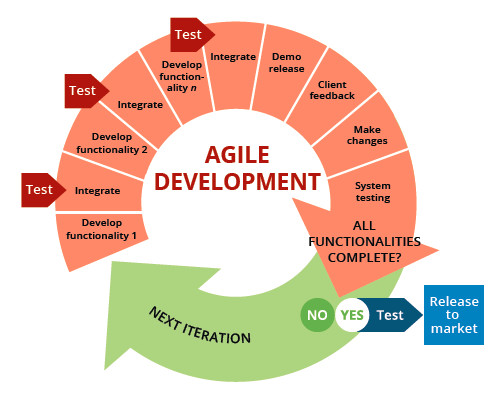

Below are few frequently used or referred terms that every Java developer comes across in Lexicographical order. This is a quick one-stop reference guide created for myself or for others who wish to brush up on these !!

## A

__Agile Development__

Agile is an iterative approach to project management and software development that helps teams deliver value to their customers faster and with fewer headaches.

__Scrum__ is a framework that helps teams work together. Much like a rugby team (where it gets its name) training for the big game, scrum encourages teams to learn through experiences, self-organize while working on a problem, and reflect on their wins and losses to continuously improve.

A __sprint__ is a short, time-boxed period when a scrum team works to complete a set amount of work. Sprints are at the very heart of scrum  and agile methodologies, and getting sprints right will help your agile team ship better software with fewer headaches

Below are the __four scrum ceremonies__ that occur in each sprint. 

* Spring Planning
* Daily Scrum
* Sprint Review
* Sprint Retrospective

__Aspect Oriented Programming (AOP)__

## B

__Bill Of Materials (BOM)__

## C

__Cloud Native__

The term cloud native refers to the concept of __building and running applications__ to take advantage of the distributed computing offered by the cloud delivery model. Cloud native apps are designed and built to exploit the scale, elasticity, resiliency, and flexibility the cloud provides.

__Container__

A container is a software package that __contains everything the software needs to run__. This includes the executable program as well as system tools, libraries, and settings

__Continuous integration (CI)__

A software engineering practice in which frequent, isolated changes are immediately tested and reported on when they are added to a larger code base.

__Continuous Delivery (CD)__

A software engineering approach in which continuous integration, automated testing, and automated deployment capabilities allow software to be developed and deployed rapidly, reliably, and repeatedly with minimal human intervention.

__Cross-Origin Resource Sharing (CORS)__

## D

__Distributed Tracing__

__Distributed System__

__Domain-Driven Design__

__Dependency Injection__ 

__DevOps__

DevOps is about removing the barriers between traditionally siloed teams, development and operations. Under a DevOps model, development and operations teams work together across the entire software application life cycle, from development and test through deployment to operations

## E

## F

__Fault isolation__

__Fault Tolerant__

## G

## H

## I

__Inversion of Control__

__Infrastructure as Code (IaC)__

## J

## K

## L

## M

__Monolithic__

__Microservices__

## N

## O

__Object Oriented Programming__

Object Oriented programming (OOP) is a programming paradigm that relies on the concept of classes and objects. It is used to structure a software program into simple, reusable pieces of code blueprints (usually called classes), which are used to create individual instances of objects.

__Orchestration__

__Obfuscation__

__Open Authorization (OAuth)__

## P

## Q

## R

## S

__Security Assertion Markup Language (SAML)__

__Serverless__: 

__Site Reliability Engineering (SRE)__

## T

## U

## V

## W

__Waterfall__

## X

## Y

## Z

## Resources
* <a href="https://dzone.com/articles/microservices-zone-glossary" target="_blank">25 Microservices Terms You Need to Know</a>
* <a href="https://blog.container-solutions.com/a-glossary-of-cloud-native-terms" target="_blank">A Glossary Of Cloud Native Terms</a>